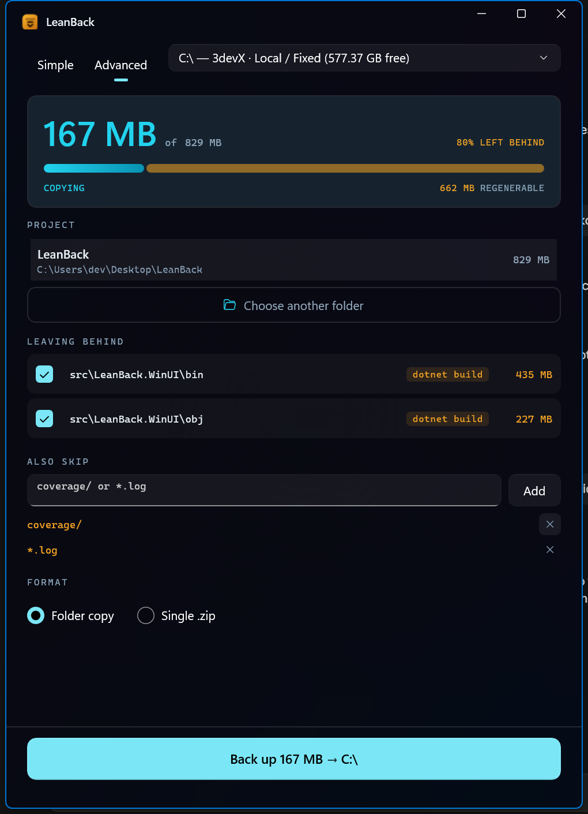
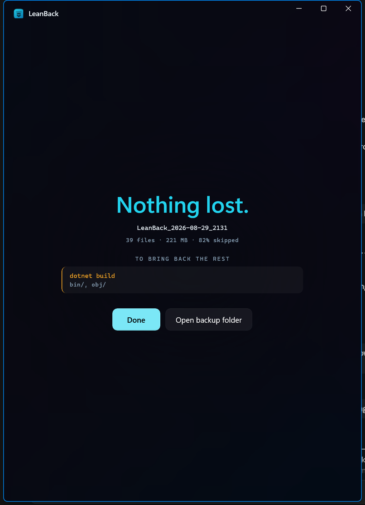

<div align="center">


# LeanBack

**Back up the code you can't get back. Skip the rest.**

A single portable Windows executable that copies your project folder to a flash drive,
external disk, or network share — and leaves out everything a package manager can rebuild.

</div>

---

## The idea

Most of a project folder isn't worth copying. `node_modules/`, `target/`, `.venv/`, `bin/`,
`obj/`, build caches — all of it is reproducible from a lockfile and one command. Backing it
up costs time and space and protects nothing.

LeanBack scans a project, works out which directories are reinstallable, and copies only what
is genuinely yours. It records the commands that bring the rest back.

A 57 GB project folder is often 2 GB that matters. Backing up this repo's own working tree:

```
829 MB on disk  ->  167 MB copied  ( 80% left behind )
```

Nothing unrecoverable is ever excluded, and every skipped directory is listed before you commit
to anything.

## Screenshots

<div align="center">

&nbsp;

</div>

The interface uses two colours and they both mean something:
**cyan is what only you have**, **amber is what you can regenerate**. That is why the skipped
sizes, the reason chips, and the `npm install` commands on the finish screen are all amber —
they are the same idea.

## Install

Download `LeanBack.exe` from the [latest release](../../releases/latest) and run it.

There is no installer and no runtime to fetch. The Windows App SDK is compiled into the
executable, so it works on a machine with nothing installed and runs fine from a flash drive.

- **Requires** Windows 10 version 1809 (build 17763) or newer, x64.
- **Runs as a standard user.** No administrator rights, ever.
- **Long-path aware**, and works from FAT32 media.

## What it does

- **Detects reinstallable directories** and proposes skipping them, with the reason shown
  (`npm install`, `dotnet build`, `cargo build`, and so on). Every row is a checkbox — nothing
  is skipped without being on screen first.
- **Custom skip patterns** per project (`coverage/`, `*.log`), remembered between runs.
- **Folder copy or a single `.zip`.**
- **Verifies every copied file** with an xxHash64 content check, not just a size comparison.
- **Keep-1 retention** — the previous backup is deleted only after the new one verifies.
- **Restore** any previous backup to a folder you choose.
- **Records the regen commands** so the skipped bulk is one command away.
- **Cancel is safe.** Backups stage as `.partial` and are removed on cancel, so a half-finished
  run never leaves a corrupt folder behind.

## Settings and portability

Settings live in `leanback.json` **next to the executable** when that location is writable —
which is what makes it genuinely portable — and otherwise in `%APPDATA%\LeanBack\`. Recent
projects, per-project skip choices, custom patterns, and backup history are all stored there.

Nothing is sent anywhere. LeanBack has no network code.

## Headless CLI

The same executable has a scripting mode, used by the acceptance tests:

```
LeanBack.exe --cli scan    <projectPath>  <out.json>
LeanBack.exe --cli backup  <request.json> <out.json>
LeanBack.exe --cli verify  <request.json> <backupDir> <out.json>
LeanBack.exe --cli restore <backupPath>   <targetDir> <out.json>
```

`request.json` is a camelCase `BackupRequest`: `path`, `dest`, `format` (`mirror` | `zip`),
`exclude` (relative directory paths), `skipGit`, `custom` (patterns), `regen`, `skipped`.
Exit code is `0` on success, `1` on failure.

## Build from source

Requires the [.NET 8 SDK](https://dotnet.microsoft.com/download/dotnet/8.0).

```powershell
powershell -ExecutionPolicy Bypass -File .\build.ps1
```

This regenerates the icon, publishes a self-contained single-file release into `release\`, and
copies `LeanBack.exe` to the repository root.

### A note on the build configuration

WinUI 3 supports `PublishSingleFile` **only** when the app is both unpackaged and
self-contained (Windows App SDK 1.5+). Those properties live in
[`LeanBack.WinUI.csproj`](src/LeanBack.WinUI/LeanBack.WinUI.csproj) and the SDK hard-errors if
any of them go missing, so `build.ps1` stays a thin wrapper:

```xml
<WindowsPackageType>None</WindowsPackageType>
<WindowsAppSDKSelfContained>true</WindowsAppSDKSelfContained>
<SelfContained>true</SelfContained>
<EnableMsixTooling>true</EnableMsixTooling>
<IncludeAllContentForSelfExtract>true</IncludeAllContentForSelfExtract>
<PublishSingleFile>true</PublishSingleFile>
```

`EnableCompressionInSingleFile` matters more than it looks: it takes the executable from
203 MB to 84 MB.

## Project layout

```
src/LeanBack.WinUI/
  Engine/          backup engine — scan, copy, zip, verify, retention, restore. No UI types.
  ViewModels/      MVVM layer over the engine
  Themes/          design tokens (light, dark, and high-contrast dictionaries)
  Program.cs       entry point; routes --cli before any UI starts
```

The engine is deliberately free of UI dependencies, which is what lets the headless CLI and the
window share exactly the same code.

The app is dark by brand rather than by system preference (`RequestedTheme="Dark"` in
`App.xaml`). The light and high-contrast dictionaries are fully authored, so removing that one
attribute makes it follow the OS instead.

## License

[MIT](LICENSE)
